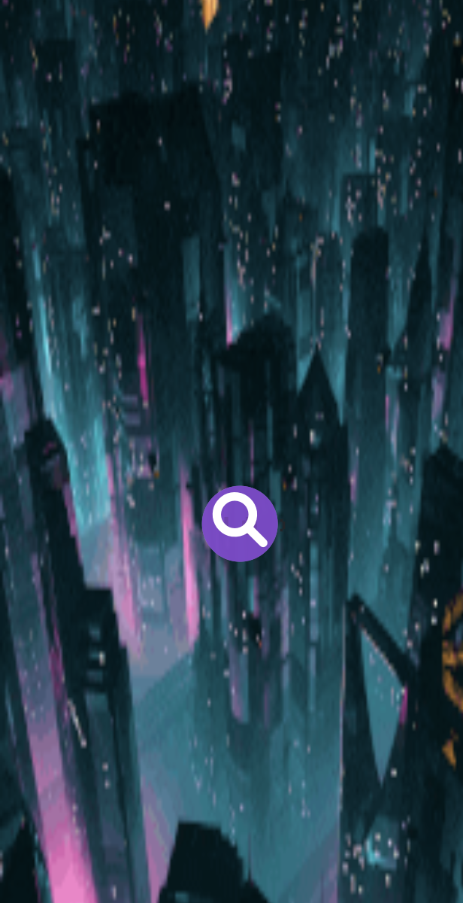

## Weather App

[Test this app yourself](https://weather-app-react-maykal-tenev.vercel.app/)

---

## The application is specifically made for mobile use!

### About Project

This project is created with React at the end of the module SPA in Digital Career Institute. It is meant to implement the Fundamentals of REACT.
The application is created with Open Weather API and the Leaflet Library. The purpose of the app is to show the weather conditions for a specific location, render a clock for the specific timezone of the location and to show the future 5 day forecast and also to display the map location.
The application is checking the weather conditions and the hour in the location. Depending on that is showing a background representing the conditions in daily or nighty mode.
Currently the web application is created to be work only on mobile version.

### How to use this Project

Click on the magnifying glass and provide a valid city location, by pressing again on the magnifying glass or by clicking 'Enter'. Weather information will be loaded and by clicking the '5' button there will be shown a short information about the future 5 day forecast and a map will be render, showing the exact location of the provided city.

##### Developed With

- [ ] _HTML5_
- [ ] _CSS3_
- [x] _SASS_
- [ ] _SCSS_
- [ ] _JavaScript_
- [x] _React_
- [ ] _Bootstrap_
- [x] _LeafletJsLibrary_

---

### Contact

Mail: <michaeltenev@mail.com> 
GitHub: [michaeltenev](https://github.com/maykaltenev) 
LinkedIn: [Maykal Tenev](https://www.linkedin.com/in/maykal-tenev-a8729586/)

---

### Used Tools

- [npm](https://www.npmjs.com/)
- [Google Fonts](https://fonts.google.com/)
- [Visual Studio Code](https://code.visualstudio.com/)
- [Adobe Color](https://color.adobe.com/create/color-wheel)
- [FontAwesome](https://fontawesome.com/)
- [LeafletJSLibrary](https://leafletjs.com/)
- [ReactClock](https://www.npmjs.com/package/react-digital-clock)

### Recourses

- [MDN Web Docs](https://developer.mozilla.org/de/)

### Credits Photo

ALl the gifs are from https://giphy.com/;
-- Clear Night: http://jameszanoni.tumblr.com/post/125360995469
-- Clear Sky: https://giphy.com/gifs/sky-butterflies-Uiujny6Aqrg40
-- Rain Night: https://giphy.com/gifs/cinemagraph-5torEEM8QnR95Cqg11
-- Rain Day: https://giphy.com/gifs/rainy-raindrops-rainfall-vLi3T5m3RH45y
-- Clouds Sky: https://giphy.com/gifs/monahayslett-clouds-weather-cloudy-0Styincf6K2tvfjb5Q
-- Fog: https://giphy.com/gifs/mist-gif-11uphU5Zfgk1vW
-- Mist: https://giphy.com/gifs/mist-amazing-beautiful-McDhCoTyRyLiEfog_mist.gif
-- Background: https://giphy.com/gifs/night-cyberpunk-cyber-punk-qauCD58fBsZy3V1rVb
-- Thunderstorm: https://giphy.com/gifs/storm-fAV73wP5H7xN6
-- Snow: https://giphy.com/gifs/christmas-snow-winter-FoVi0LDjy1XS8
-- Error: http://abelmvada.tumblr.com/post/157548059742/pilot

#### Clock

Is inspired from:
https://www.npmjs.com/package/react-digital-clock
But there is a little twist on it from my side with the correct timezone.

---

Made with ❤️ by me
